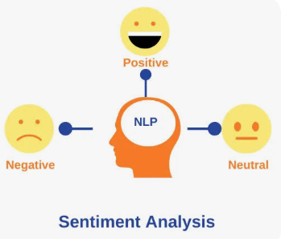

# Twitter Sentiment Analysis

---

## 1. Business Understanding

### 1.1 Overview

In the modern digital era, social media platforms like Twitter (now X) have become powerful channels for consumers to express opinions, experiences, and emotions about brands, products, and services. These views can significantly influence purchasing decisions, brand reputation, and marketing strategies.

Manually tracking and interpreting this vast, unstructured feedback is impractical for companies. As a result, organizations increasingly turn to **Natural Language Processing (NLP)** and **machine learning models** to automatically analyze and interpret tweet sentiments.

*Figure 1: Illustration of how Natural Language Processing (NLP) processes and classifies text to produce outputs.*

---

### 1.2 Business Problem

Businesses need to understand **how customers feel** about their products and brands in real time. However, the sheer volume and unstructured nature of tweets make manual analysis impossible.

The core challenge is to **automatically classify each tweet** as **positive**, **negative**, or **neutral**. This provides actionable insights to:

- Identify emerging trends in customer satisfaction or dissatisfaction.
- Track public reactions to product launches or campaigns.
- Inform data-driven marketing and customer engagement decisions.

---

### 1.3 Project Objective

**Main Objective:**  
To **develop an automated sentiment classification model** that accurately analyzes and categorizes sentiments expressed in posts on **X (formerly Twitter)** as **positive, negative, or neutral**, enabling real-time insights into customer perceptions of a brand to support **data-driven marketing** and **brand management decisions**.

**Specific Objectives:**  

1. **Build a Binary Classification Model:**  
   Develop and train a machine learning model to accurately distinguish between **positive** and **negative** sentiments in X posts.  

2. **Extend to Multiclass Classification:**  
   Enhance the model to classify posts into **three categories**:  
   - No emotion toward brand or product (Neutral)
   - Positive emotion  
   - Negative emotion  
   This should be done **while maintaining or improving overall classification performance**.

3. **Support Business Decision-Making:**  
   Deliver **interpretable sentiment insights** to marketing teams and brand managers to:  
   - Optimize campaigns  
   - Address customer concerns  
   - Enhance brand reputation  

---

### 1.4 Business Value

An accurate sentiment analysis system delivers substantial value to decision-makers by enabling:

- **Brand Monitoring**: Track customer feelings about the brand over time.  
- **Marketing Optimization**: Pinpoint campaigns that drive positive engagement or negative feedback.  
- **Customer Insights**: Uncover pain points or drivers of satisfaction.  
- **Faster Decision-Making**: Provide near real-time feedback analysis.  

---

### 1.5 Research Questions

1. **How do customers feel about the company’s products or services**, based on sentiments expressed on Twitter?  
2. **What key factors or topics drive positive and negative sentiments** toward the brand on Twitter?  
3. **How can Twitter sentiment insights support business decisions**, such as marketing strategies, customer engagement, and brand reputation management?

---

### 1.6 Success Criteria

The project's success will be measured by:

1. **Actionable Insights**: The system delivers meaningful customer opinion trends on Twitter, supporting data-driven decisions.  
2. **Brand Reputation Tracking**: Enables real-time monitoring of public sentiment, allowing timely responses to issues.  
3. **Marketing and Engagement Impact**: Insights improve strategies, engagement, and brand perception based on identified trends.

___
## 2. Data Understanding  

### 2.1 Overview  
The dataset used in this project is the **Brands and Products Emotions** dataset, obtained from **data.world** ([source link](https://data.world/crowdflower/brands-and-product-emotions)). It contains tweets evaluated for emotional content directed toward various products and brands.  

**Dataset characteristics:**  
- **Rows:** 9,093  
- **Columns:** 3  
- **Target variable:** `is_there_an_emotion_directed_at_a_brand_or_product`  
- **Feature variables:**  
  - `emotion_in_tweet_is_directed_at` – indicates the brand or product the emotion is directed toward  
  - `tweet_text` – contains the actual text of the tweet  

---

### 2.2 Target Variable Distribution  
**Observations:**  
- A significant portion of tweets **do not express a clear sentiment** toward a brand or product.  
- The dataset is **imbalanced**, with some emotion categories (e.g., negative) being underrepresented.  
- Tweets labeled **“I can’t tell”** are ambiguous and may be excluded during data cleaning.  
- Depending on the modeling goal, this can be framed as either:  
  - **Binary classification:** Positive vs. Negative  
  - **Multiclass classification:** Positive, Negative, Neutral, etc.  

---

### 2.3 Brand / Product Distribution  
Tweets in the dataset reference multiple brands and their associated products, such as:  
- **Apple:** iPhone, iPad, iPad or iPhone App, Other Apple product or service  
- **Google:** Google, Android, Android App, Other Google product or service  

**Observations:**  
- Multiple product names represent the same brand (e.g., iPhone and iPad → Apple).  
- Apple and Google dominate the dataset, making them suitable for comparative analysis.  
- Smaller product categories may be aggregated under their parent brands for consistency during preprocessing.  

---

### 2.4 Text Characteristics  
- Tweet lengths range from very short to long, reflecting natural user variability.  
- Texts contain **noisy elements** such as:  
  - Mentions (`@username`)  
  - Hashtags (`#keyword`)  
  - URLs, emojis, and punctuation  
- These artifacts require **text preprocessing** steps such as removal of special characters, tokenization, and lemmatization before modeling.  

---

### 2.5 Key Insights  
1. The dataset is sufficiently large for building a sentiment classification model.  
2. **Imbalanced sentiment distribution** warrants use of metrics like **F1-score** or **ROC-AUC** instead of accuracy alone.  
3. Text cleaning and normalization are crucial due to noise, abbreviations, and inconsistent brand mentions.  

# 3.DATA PREPARATION

## 1. Data Cleaning
- **Filtered Data:** Kept only tweets with clear emotions (‘Positive emotion’, ‘Negative emotion’)
- **Dropped Column:** `emotion_in_tweet_is_directed_at`
- **Duplicates:** Removed previously (22 duplicates)
- **Resulting Data Shape:** (number of records after filtering)

## 2. Text Preprocessing
Applied NLTK-based cleaning function:
- Converted text to lowercase  
- Removed URLs, mentions, hashtags, numbers, and punctuation  
- Tokenized text and removed stopwords  
- Lemmatized words using WordNetLemmatizer  
- Created new column: `clean_text`

<pre><code class="language-python">
# Initializing lemmatizer and stopwords
lemmatizer = WordNetLemmatizer()
stop_words = set(stopwords.words('english'))

class TextCleaner(BaseEstimator, TransformerMixin):
    def __init__(self):
        self.lemmatizer = WordNetLemmatizer()
        self.stop_words = set(stopwords.words('english'))

    def clean_text(self, text):
        text = text.lower()
        text = re.sub(r'http\S+|www\S+', '', text)
        text = re.sub(r'@\w+', '', text)
        text = re.sub(r'#', '', text)
        text = re.sub(r'\d+', '', text)
        text = text.translate(str.maketrans('', '', string.punctuation))
        tokens = word_tokenize(text)
        tokens = [t for t in tokens if t not in self.stop_words or t in {'not', 'no', 'never'}]
        tokens = [self.lemmatizer.lemmatize(t) for t in tokens]
        return ' '.join(tokens)

    def fit(self, X, y=None):
        return self

    def transform(self, X):
        return X.apply(self.clean_text)
</code></pre>

## 3. Label Encoding
Mapped sentiment labels:
- Positive emotion → 1  
- Negative emotion → 0  
Created new column: `label`

## 4. Data Splitting
- Split data into **Train (80%)** and **Test (20%)** sets  
- Used `stratify=y` to preserve class balance  

## 5. Feature Engineering (Text to Numeric)
- Used **TF-IDF Vectorizer** with:
  - `max_features=5000`
  - `ngram_range=(1,2)`  
- Transformed text data into numeric feature matrix for model input.

## 6. Handling Class Imbalance
- Applied **SMOTE (Synthetic Minority Oversampling Technique)** on training data  
- Balanced positive and negative samples for fair model training.

---

*Output:* Cleaned, vectorized, and balanced dataset ready for the **Modeling Phase**.

---

###  Handling missing values and Duplicates
Drop columns with more than 50% missing values and drop the duplicates.

### Modeling

Three machine learning models were trained and compared:

Logistic Regression

Random Forest Classifier

XGBoost Classifier

### Key Findings:

Model Performance:
- All models perform better in binary classification compared to multiclass
- The addition of neutral class significantly increases classification complexity

Class Imbalance:

- Models handle class imbalance well due to SMOTE implementation
- Performance is relatively balanced across different sentiment classes
- Negative class is the most challenging to classify accurately

Trade-offs:
- Logistic Regression: Simple and best for binary tasks
- Random Forest: Good balance of performance and interpretability
- XGBoost: Powerful and flexible, but requires more resources

Recommendations:
For production use, consider:
- Using XGBoost if computational resources allow
- Random Forest as a good compromise between performance and complexity
- Logistic Regression for scenarios requiring real-time predictions

For improving model performance:

 - Collect more training data for underrepresented classes
 - Fine-tune hyperparameters further
 - Consider ensemble methods combining multiple models

For deployment:

 - Monitor model performance over time
 - Implement periodic retraining
 - Consider model versioning for different use cases (binary vs multiclass)

This is the deployment link

  

 
 ### Author

Elsie
Tiffany
Khalid
Meshack
Jeremy
